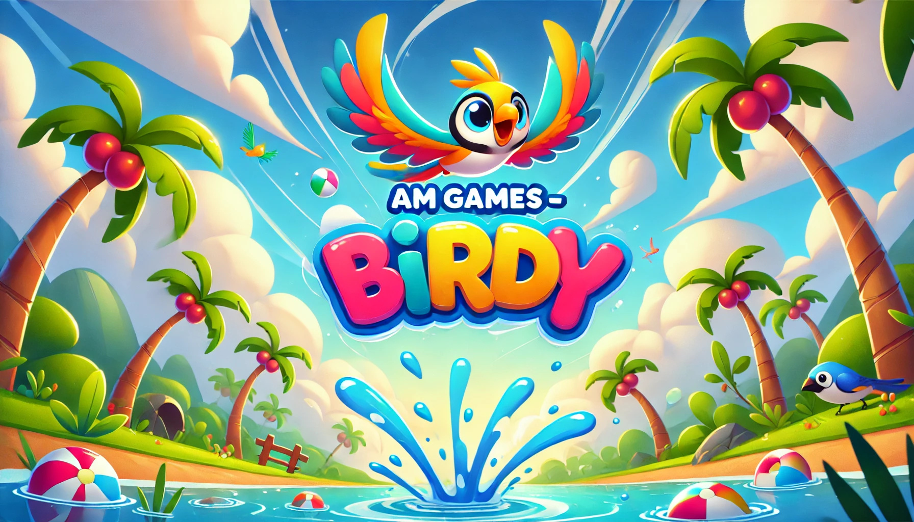

# AM Games - Birdy

Welcome to **AM Games - Birdy**, a fun and engaging Flappy Bird-style game! Navigate your bird through obstacles, challenge your reflexes, and aim for the highest score.

## Game Overview

AM Games - Birdy is a basic yet addictive Flappy Bird game with vibrant graphics and smooth gameplay. Players control a bird that must fly through pipes without crashing. The game is simple to play but challenging to master, making it enjoyable for players of all ages.

### Features
- **Colorful Graphics**: Enjoy the bright and cheerful visuals that make the game lively.
- **Smooth Gameplay**: Responsive controls for an immersive experience.
- **Cross-Platform**: Available for both Android and Windows.
- **Compete for High Scores**: Challenge yourself and others to beat the top score.

## Downloads

### Android
[Download APK](https://drive.google.com/uc?export=download&id=17yqwKaKMmos8rLxWf_ZkNP-_dF25hI_x)

### Windows
[Download Windows Build](https://drive.google.com/uc?export=download&id=1xrxnTr_TOwME7JambxZJGwwG7c57TePv)

## Installation Instructions

### Android
1. Download the APK file from the link above.
2. Transfer the APK file to your Android device if downloaded on a PC.
3. Open the file and follow the on-screen instructions to install the game.
4. Ensure you have enabled installation from unknown sources in your device settings.

### Windows
1. Download the Windows build from the link above.
2. Extract the downloaded ZIP file (if applicable).
3. Run the `.exe` file to start the game.

## How to Play
1. Tap (on mobile) or press the spacebar (on Windows) to make the bird flap its wings.
2. Navigate the bird through the pipes without hitting them.
3. The further you go, the higher your score!

## Screenshots

## Feedback and Support
We’d love to hear your thoughts about the game! If you have any feedback or run into issues, feel free to reach out:
- Email: [support@amgames.com](https://aditya29mishra.web.app/contact-me)

## License
This project is licensed under the MIT License. Feel free to modify and share the game with proper attribution.

Enjoy playing **AM Games - Birdy** and have fun!

